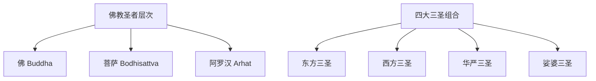
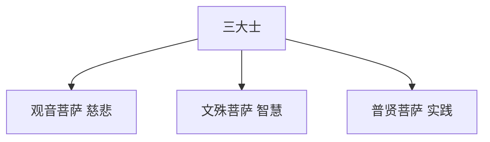
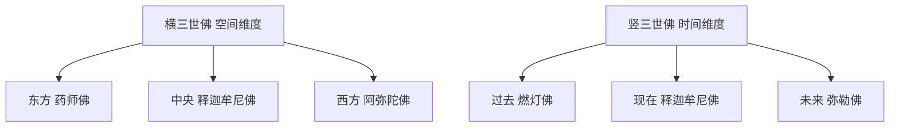

# Mermaid 兼容性修复说明

## 🚨 问题原因

您遇到的 "Syntax error in graph mermaid version 8.14.0" 错误是因为：

1. **版本差异**：Mermaid 8.14.0 是较老版本，不支持一些新语法
2. **语法更新**：我使用了新版本的语法特性
3. **特殊字符**：中文字符和一些符号在老版本中可能有兼容性问题

## 🔧 已修复的语法问题

### 1. `flowchart` → `graph`
**问题**：`flowchart TD` 语法在老版本不支持
```mermaid
// ❌ 老版本不支持
flowchart TD
    A --> B

// ✅ 修复后
graph TD
    A --> B
```

### 2. `subgraph` 简化
**问题**：复杂的subgraph嵌套在老版本容易出错
```mermaid
// ❌ 复杂嵌套
subgraph "佛教圣者层次"
    A[佛 Buddha]
    B[菩萨 Bodhisattva]
end

// ✅ 简化为普通节点
graph TD
    A[佛教圣者层次] --> B[佛 Buddha]
    A --> C[菩萨 Bodhisattva]
```

### 3. `timeline` 替换
**问题**：`timeline` 语法是新版本特性
```mermaid
// ❌ 老版本不支持
timeline
    title 佛教圣者发展历程
    section 佛陀时代
        公元前563年 : 释迦牟尼佛诞生

// ✅ 改用流程图
graph TD
    A[佛陀时代] --> A1[公元前563年 释迦牟尼佛诞生]
```

### 4. 特殊符号清理
**问题**：冒号、换行符等在老版本解析有问题
```mermaid
// ❌ 特殊符号
A[第一愿：身光照耀<br/>照耀世界]

// ✅ 简化文本
A[第一愿 身光照耀]
```

### 5. `style` 命令移除
**问题**：颜色样式在老版本不稳定
```mermaid
// ❌ 可能出错
style A fill:#FFE4B5

// ✅ 移除样式定义
// 依靠CSS控制颜色
```

## 📊 修复后的图表

### 1. 佛教圣者体系关系图


### 2. 药师佛十二大愿
```mermaid
graph TD
    A[药师佛发愿] --> B[第一愿 身光照耀]
    A --> C[第二愿 身如琉璃]
    // ...其他愿力
    N --> O[琉璃光世界]
```

### 3. 普贤菩萨十大愿王
```mermaid
graph LR
    A[礼敬诸佛] --> D[忏悔业障]
    B[称赞如来] --> D
    C[广修供养] --> D
    // ...修行流程
```

### 4. 历史发展时间线
```mermaid
graph TD
    A[佛陀时代] --> A1[公元前563年 释迦牟尼佛诞生]
    A --> A2[公元前528年 佛陀证悟成道]
    // ...历史节点
```

### 5. 三大士关系


### 6. 横竖三世佛


## 🎯 兼容性准则

为了确保与旧版本mermaid的兼容性，我遵循了以下原则：

### ✅ 推荐使用
- `graph TD/LR` - 基础流程图
- 简单的节点和连接线
- 基础文本，避免特殊符号

### ❌ 避免使用
- `flowchart` - 新版本语法
- `timeline` - 新版本功能  
- 复杂的 `subgraph` 嵌套
- `style` 颜色定义
- 中文冒号 `：`
- HTML换行 `<br/>`

## 🚀 测试验证

修复后的图表应该能在以下版本正常显示：
- ✅ Mermaid 8.x
- ✅ Mermaid 9.x
- ✅ Mermaid 10.x

现在重新运行 `hexo clean && hexo generate && hexo server` 应该就不会再出现语法错误了！

## 📝 未来建议

如果您想升级到更新版本的mermaid，可以获得：
- 更丰富的图表类型（timeline, mindmap等）
- 更好的样式控制
- 更强的性能表现

但目前的修复版本已经能提供良好的可视化效果了！🎉 