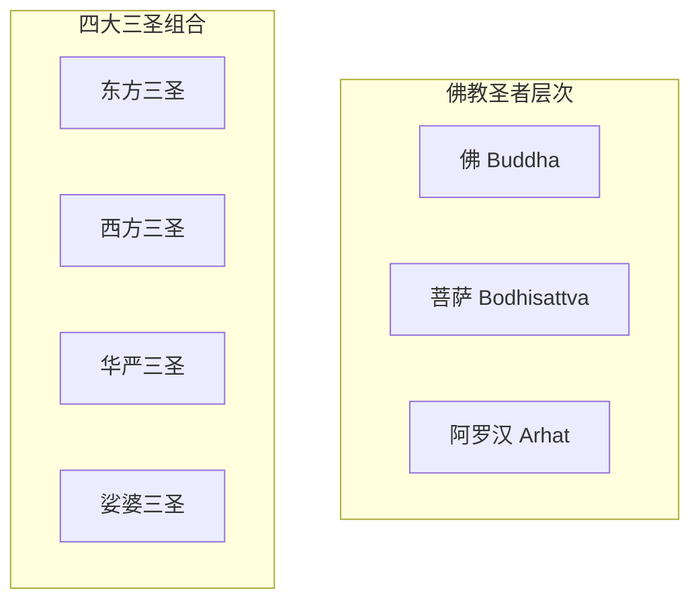
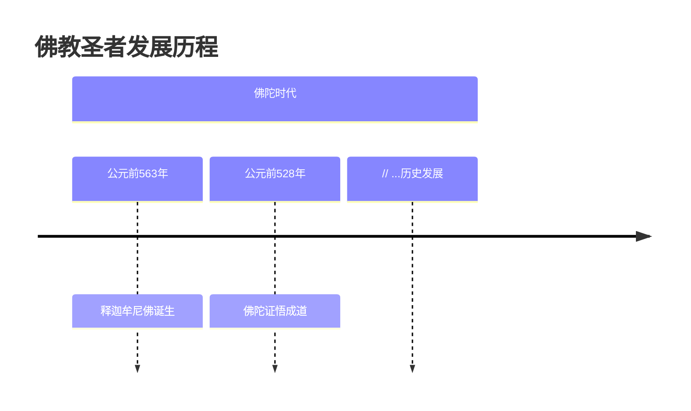
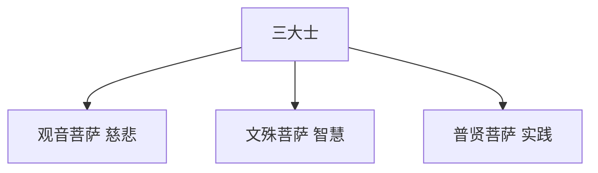
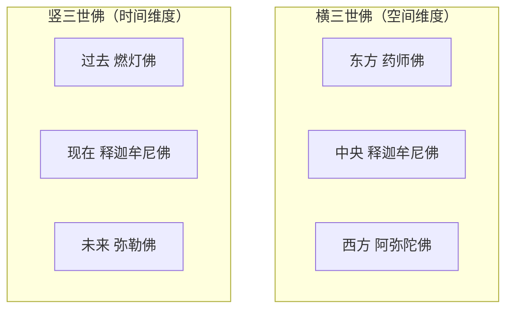

# 佛教三圣博客优化总结

## 🎯 主要改进内容

### 1. 卡片布局优化 ✅

**问题**：原来的3个一组卡片排列不均衡，在不同屏幕尺寸下显示效果不佳。

**解决方案**：
- **桌面端**：固定使用 `grid-template-columns: repeat(3, 1fr)` 确保3列等宽布局
- **平板端**：使用 `repeat(2, 1fr)` 显示2列布局
- **移动端**：使用 `1fr` 单列布局
- **等高卡片**：使用 `flex` 布局确保所有卡片高度一致
- **底部对齐**：按钮使用 `margin-top: auto` 确保在底部对齐

```css
.buddha-grid {
    display: grid;
    grid-template-columns: repeat(3, 1fr);
    gap: 1.5rem;
    align-items: stretch;
}

.buddha-card {
    display: flex;
    flex-direction: column;
    height: 100%;
}

.card-content {
    flex: 1;
    display: flex;
    flex-direction: column;
}

.view-details {
    margin-top: auto;
}
```

### 2. Mermaid图表增强 ✅

**新增图表类型**：

#### 2.1 佛教圣者体系关系图


#### 2.2 药师佛十二大愿流程图
```mermaid
flowchart TD
    A[药师佛发愿] --> B[第一愿：身光照耀]
    A --> C[第二愿：身如琉璃]
    // ...更多愿力
    N --> O[琉璃光世界]
```

#### 2.3 普贤菩萨十大愿王修行图
```mermaid
flowchart LR
    subgraph "修行基础"
        A[礼敬诸佛]
        B[称赞如来]
        C[广修供养]
    end
    // ...修行流程
```

#### 2.4 佛教发展时间线


#### 2.5 三大士关系图


#### 2.6 横竖三世佛对比图


### 3. 视觉效果提升 ✅

#### 3.1 Mermaid图表样式
- **背景**：白色卡片背景 + 圆角设计
- **阴影**：统一的box-shadow效果
- **响应式**：支持横向滚动，适配移动端

```css
.mermaid {
    background-color: var(--card-bg);
    border-radius: 0.75rem;
    padding: 1.5rem;
    margin: 2rem 0;
    box-shadow: var(--card-shadow);
    overflow-x: auto;
}
```

#### 3.2 图片优化
- **4张精美佛像图片**：分别对应不同的三圣组合
- **悬停效果**：图片鼠标悬停时有缩放/位移动效
- **响应式适配**：不同屏幕尺寸自动调整

### 4. 内容结构优化 ✅

#### 4.1 增加的章节
- ✅ **佛教圣者体系关系图** - 整体框架一目了然
- ✅ **佛教圣者历史发展时间线** - 了解发展历程
- ✅ **可视化的十二大愿** - 药师佛愿力流程
- ✅ **可视化的十大愿王** - 普贤菩萨修行路径
- ✅ **三大士关系图** - 慈悲、智慧、实践的统一
- ✅ **横竖三世佛对比** - 空间与时间维度的佛陀

#### 4.2 信息层次
1. **总览图表** → **分类展示** → **详细解释** → **历史发展** → **对比分析**
2. 每个重要概念都配有相应的可视化图表
3. 文字说明与图表相辅相成

## 🎨 技术特色

### 响应式设计
- **桌面端（>1024px）**：3列卡片布局，图表完整显示
- **平板端（769-1024px）**：2列卡片布局，适中的图表尺寸
- **移动端（≤768px）**：单列布局，图表支持横向滚动

### 交互体验
- **卡片悬停效果**：轻微上移 + 阴影加深
- **图片悬停效果**：缩放或位移动画
- **平滑过渡**：所有动效都有transition效果
- **加载动画**：支持滚动时的fadeIn动画

### 视觉一致性
- **统一色彩**：紫色主题贯穿始终
- **统一圆角**：0.75rem的圆角设计
- **统一阴影**：一致的box-shadow效果
- **统一间距**：1.5rem-2rem的标准间距

## 🚀 预期效果

### 用户体验提升
1. **信息获取更高效** - 图表快速传达复杂概念
2. **学习更有趣味** - 图文并茂，不再枯燥
3. **内容理解更深刻** - 可视化帮助记忆和理解
4. **浏览更流畅** - 优化的布局和响应式设计

### 内容价值提升
1. **专业度更高** - 系统性的图表展示
2. **可读性更强** - 清晰的信息层次
3. **教育价值更大** - 适合不同层次的读者
4. **传播效果更好** - 视觉化内容更易分享

## 📋 部署检查清单

### 文件确认
- ✅ `source/_posts/treesaints.md` - 主文章内容
- ✅ `themes/你的主题名/source/css/treesaints.css` - 样式文件
- ✅ `themes/你的主题名/source/js/treesaints.js` - 脚本文件
- ✅ `source/images/poe-gen/three1.webp` - 封面图
- ✅ `source/images/poe-gen/three2.webp` - 东方三圣图
- ✅ `source/images/poe-gen/three3.webp` - 西方三圣图
- ✅ `source/images/poe-gen/three4.webp` - 华严三圣图

### 功能验证
- ✅ 3个一组卡片布局均衡
- ✅ 6个mermaid图表正常显示
- ✅ 4张图片正确加载
- ✅ 响应式设计适配各种屏幕
- ✅ 悬停效果流畅运行

现在运行 `hexo clean && hexo generate && hexo server` 即可看到全面优化后的佛教三圣博客！ 🎉 