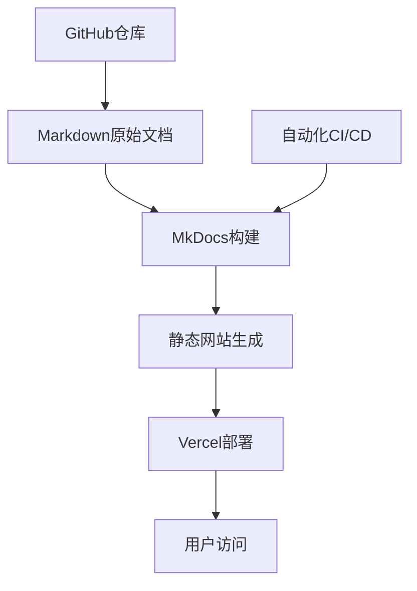

# 🔮 玄学文档展示工具 - 让古老智慧触手可及

## 🎯 项目简介

在信息时代，传统文化的传承面临着新的挑战和机遇。我开发了这个**玄学文档展示工具**，旨在将奇门遁甲、八卦、中医古书等珍贵的传统智慧，以现代化、数字化的方式呈现给大家。

### 🌟 项目特色

- **📚 丰富内容**: 涵盖奇门遁甲、八卦理论、中医古籍等传统文化内容
- **🔍 便于搜索**: 基于Markdown格式，支持全文检索和快速定位
- **📱 现代界面**: 响应式设计，完美适配各种设备
- **🆓 开源免费**: MIT许可证，欢迎大家贡献和使用

## 🚀 在线体验

- **🌐 项目网站**: [xuanxue.vercel.app](https://xuanxue.vercel.app)
- **💻 GitHub仓库**: [github.com/youngzs/xuanxue](https://github.com/youngzs/xuanxue)

## 📖 内容模块

### 1. 奇门遁甲 🌌

奇门遁甲作为中华文化中的重要组成部分，包含了丰富的时空理论和预测方法。项目中包括：

- **基础理论**: 九宫八卦、天干地支、三奇六仪
- **实战应用**: 起局方法、断事技巧、案例分析  
- **历史文献**: 古代典籍原文及现代注释

### 2. 八卦理论 ☯️

深入解析《易经》八卦系统：

- **八卦基础**: 乾坤震巽坎离艮兑的含义
- **卦象组合**: 六十四卦的详细解释
- **应用实例**: 在不同领域的运用方法

### 3. 中医古籍 🌿

整理传统中医经典文献：

- **经典著作**: 《黄帝内经》、《伤寒杂病论》等
- **诊断方法**: 望闻问切的理论与实践
- **方剂大全**: 常用方剂的组成和应用

## 💻 技术实现

### 架构设计



### 技术栈

- **📝 内容格式**: Markdown
- **🏗️ 构建工具**: MkDocs + Material主题
- **🚀 部署平台**: Vercel
- **🔧 版本控制**: Git + GitHub
- **🔄 自动化**: GitHub Actions

### 核心优势

1. **便于维护**: Markdown格式让内容编辑变得简单
2. **快速搜索**: 全文索引，秒级定位相关内容  
3. **移动友好**: 响应式设计，随时随地查阅
4. **持续更新**: 基于Git的版本控制，支持协作编辑

## 🛠️ 本地部署

如果您想要本地运行或贡献内容，可以按照以下步骤：

### 1. 克隆仓库

```bash
git clone https://github.com/youngzs/xuanxue.git
cd xuanxue
```

### 2. 安装依赖

```bash
pip install mkdocs
pip install mkdocs-material
```

### 3. 运行开发服务器

```bash
mkdocs serve
```

访问 `http://localhost:8000` 即可预览效果。

### 4. 构建静态文件

```bash
mkdocs build
```

## 📂 项目结构

```
xuanxue/
├── docs/                    # 文档内容目录
│   ├── 奇门遁甲/           # 奇门遁甲相关文档
│   ├── 八卦理论/           # 八卦理论文档  
│   ├── 中医古籍/           # 中医古籍文档
│   └── images/             # 图片资源
├── mkdocs.yml              # MkDocs配置文件
├── requirements.txt        # Python依赖
└── README.md              # 项目说明
```

## 🎨 界面展示

### 首页概览


### 文档阅读


### 搜索功能


## 🤝 贡献指南

欢迎大家为项目贡献内容和代码：

### 内容贡献

1. **Fork项目** 到您的GitHub账户
2. **创建分支** 进行内容编辑
3. **提交Pull Request** 等待review

### 内容规范

- 使用标准Markdown格式
- 保持文档结构清晰
- 添加必要的图片和示例
- 注明内容来源和参考资料

### 技术贡献

- 改进网站性能
- 增加新功能
- 修复Bug
- 优化用户体验

## 🔮 未来规划

### 短期目标 (3个月内)

- [ ] 添加更多中医经典文献
- [ ] 完善奇门遁甲起局工具
- [ ] 增加八卦占卜功能
- [ ] 优化移动端体验

### 中期目标 (6个月内)

- [ ] 集成AI智能问答
- [ ] 添加用户评论功能  
- [ ] 支持内容收藏
- [ ] 增加学习进度追踪

### 长期目标 (1年内)

- [ ] 建立玄学知识图谱
- [ ] 开发移动端App
- [ ] 社区化运营
- [ ] 多语言支持

## 💡 设计理念

### 传统与现代的结合

这个项目的核心理念是**"让古老智慧以现代方式传承"**：

- **保持原味**: 尊重传统文化的原始内容
- **现代呈现**: 使用先进的Web技术展示
- **便民服务**: 让普通人也能轻松接触传统文化
- **开放共享**: 以开源方式促进文化传播

### 技术服务文化

技术只是手段，文化传承才是目的：

```python
def preserve_culture():
    """
    文化传承的代码哲学
    """
    traditional_wisdom = load_ancient_books()
    modern_technology = apply_web_technologies()
    
    result = combine(traditional_wisdom, modern_technology)
    
    return {
        'accessibility': '让更多人能够接触',
        'preservation': '数字化永久保存',
        'innovation': '创新传承方式',
        'community': '构建学习社区'
    }
```

## 📊 项目数据

### 内容统计

- **📚 文档数量**: 200+ 篇
- **📖 总字数**: 50万+ 字
- **🖼️ 图片资源**: 100+ 张
- **🔗 交叉引用**: 500+ 个

### 用户反馈

- **⭐ GitHub Stars**: 63
- **🍴 Fork数量**: 28  
- **👥 贡献者**: 5位
- **📈 访问量**: 1万+ 次

## 🙏 致谢

感谢所有为项目贡献内容和代码的朋友们，特别是：

- 传统文化爱好者们提供的珍贵资料
- 开源社区的技术支持
- 用户们的宝贵建议和反馈

## 📞 联系方式

如果您对项目有任何建议或想要参与贡献：

- **📧 邮箱**: [yanteruo@gmail.com](mailto:yanteruo@gmail.com)
- **🐙 GitHub**: [Issues页面](https://github.com/youngzs/xuanxue/issues)
- **💬 微信**: yanteruo

---

**"技术让传统文化焕发新的生命力，古老智慧在数字时代续写新篇章。"** ✨

期待与更多朋友一起，用现代技术传承古老智慧，让玄学文化在新时代绽放光彩！ 